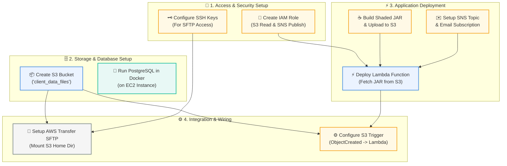

# SFTP to Database CSV Processing Pipeline

An event-driven Spring Boot and AWS Lambda pipeline that processes CSV files uploaded via SFTP, parses them, persists records into a PostgreSQL database, and publishes status notifications to Amazon SNS that send emails.

---

## 🛠️ Phase 1: Infrastructure Setup & Deployment Flow

The diagram below illustrates the sequential order in which the various cloud components are created, configured, and linked:



---

## 🔄 Phase 2: Automated Runtime Execution Flow

Once the setup is complete, the file ingestion pipeline runs automatically whenever a client initiates a file transfer:

```mermaid
flowchart LR
    %% Styling Classes for Visual Clarity
    classDef external fill:#FFEAEA,stroke:#FF5A5A,stroke-width:2px,color:#333;
    classDef aws fill:#EBF3FF,stroke:#4A90E2,stroke-width:2px,color:#333;
    classDef database fill:#E8F8F5,stroke:#1ABC9C,stroke-width:2px,color:#333;
    classDef server fill:#F5F5F5,stroke:#7F8C8D,stroke-width:2px,color:#333;

    Client(["👤 SFTP Client"]):::external
    SFTP_Server["📡 AWS SFTP Gateway"]:::server
    S3_Bucket["📦 S3 Bucket<br>(client_data_files)"]:::aws
    Lambda_Func["⚡ Lambda Function<br>(Spring Boot Context)"]:::aws
    Postgres_DB["🐳 PostgreSQL DB<br>(Docker on EC2)"]:::database
    SNS_Topic["✉️ Amazon SNS Topic"]:::aws
    User_Email(["📧 User Email Inbox"]):::external

    %% Execution Steps
    Client -->|1. Uploads CSV| SFTP_Server
    SFTP_Server -->|2. Writes Object| S3_Bucket
    S3_Bucket -->|3. s3:ObjectCreated Trigger| Lambda_Func
    Lambda_Func -->|4. Stream CSV & Save| Postgres_DB
    Lambda_Func -->|5. Publish Execution Status| SNS_Topic
    SNS_Topic -->|6. Send Status Email| User_Email
```



---

## 🛠️ Step-by-Step Deployment & Infrastructure Setup

This pipeline is deployed using managed AWS services and an EC2-hosted database:

### 1. IAM Role Setup
* Create an IAM Role for the Lambda execution with trust policies allowing AWS Lambda to assume the role.
* Attach policies granting:
  * S3 read access (e.g., `AmazonS3ReadOnlyAccess` or a custom policy for the bucket `client_data_files`).
  * SNS publication access (e.g., `AmazonSNSFullAccess` or a policy for the target status topic).
  * AWS Lambda basic execution permissions (for CloudWatch logging).

### 2. S3 Bucket Creation
* Create an Amazon S3 bucket named `client_data_files`.
* Configure the bucket with appropriate access control and block public access settings.

### 3. Lambda Function Creation
* Create an AWS Lambda function with the **Java 17** runtime.
* Attach the previously created IAM Role to this function.
* Adjust Lambda settings:
  * **Memory:** Allocate at least 1024 MB (to optimize Spring Boot cold start speeds).
  * **Timeout:** Set to 1–2 minutes to allow adequate time for Spring Boot context bootstrapping and file processing.

### 4. Build and Upload Shaded JAR
* Build the shaded execution JAR locally:
  ```bash
  ./mvnw clean package
  ```
* Because the resulting shaded file (`target/sftp-0.0.1-SNAPSHOT-exec.jar`) includes all Spring Boot libraries and AWS SDK dependencies, its size exceeds direct upload limits.
* **Upload via S3:** Upload the shaded JAR to your S3 bucket, then configure AWS Lambda to fetch the deployment package from that S3 location.

### 5. EC2 & PostgreSQL Database Setup
* Launch an Amazon EC2 instance (e.g., Ubuntu server).
* Install Docker on the EC2 instance.
* Run a PostgreSQL container inside Docker:
  ```bash
  docker run -d --name postgres-db -e POSTGRES_PASSWORD=1234 -p 5432:5432 postgres
  ```
* Connect to PostgreSQL and create the schema:
  ```sql
  CREATE SCHEMA lambda_schema;
  ```
* Ensure the EC2 Security Group permits inbound traffic on port `5432` from your Lambda function's Security Group or VPC subnet.

### 6. AWS Transfer Family (SFTP) Configuration
* Create a server in AWS Transfer Family using the SFTP protocol.
* Choose SSH public key authentication for SFTP users.
* Map the SFTP user's home directory path to the `client_data_files` S3 bucket.
* When the SFTP user uploads a file, it will write directly into the S3 bucket.

### 7. Trigger & Notifications Setup
* **S3 Trigger:** Configure S3 Event Notifications on the `client_data_files` bucket to fire an `s3:ObjectCreated:*` event that triggers your Lambda function.
* **SNS Topic:** Create an Amazon SNS Topic. Add an email subscription to this topic.
* **Lambda Config:** Set the SNS Topic ARN and database connection variables in your Lambda Environment variables so the Spring application can connect to your database and publish success/failure emails.

---

## 📂 Project Structure

```text
├── pom.xml                        # Maven dependencies and shading configuration
├── set-env.sh                     # Template for setting local environment variables
├── src
│   ├── main
│   │   ├── java
│   │   │   └── com/lambda/sftp
│   │   │       ├── SftpApplication.java       # Standard Spring Boot entry point
│   │   │       ├── config
│   │   │       │   ├── S3Config.java          # AWS S3 Client setup
│   │   │       │   └── SnsClientConfig.java   # AWS SNS Client setup
│   │   │       ├── controller
│   │   │       │   └── CsvFileController.java # Local REST API controller for upload testing
│   │   │       ├── entity
│   │   │       │   └── Users.java             # JPA Entity representing the 'users' table
│   │   │       ├── lambda
│   │   │       │   └── LambdaHandler.java     # AWS Lambda RequestHandler (Event-trigger)
│   │   │       ├── repo
│   │   │       │   └── UsersRepository.java   # Spring Data JPA Repository
│   │   │       └── service
│   │   │           ├── CsvFileProcessor.java  # CSV parsing and persistence logic
│   │   │           └── S3util.java            # S3 file downloader utility
│   │   └── resources
│   │       ├── application.yaml   # Spring configurations, DB connections & AWS settings
│   │       └── db/changelog       # Liquibase database schema migration scripts
```

---

## 🗄️ Database Schema

The database schema is managed via **Liquibase** under the `lambda_schema` schema. When the Spring Boot application boots, it executes migrations automatically.

### User Table Columns (`lambda_schema.users`)

| Column Name | Data Type | Key Type | Default Value | Description |
| :--- | :--- | :--- | :--- | :--- |
| `id` | `UUID` | Primary Key | `gen_random_uuid()` | Unique user identifier |
| `email` | `VARCHAR(255)` | Unique | *None (NOT NULL)* | User's email address |
| `name` | `VARCHAR(50)` | - | `NULL` | User's full name |
| `phone` | `VARCHAR(20)` | - | `NULL` | User's phone number |
| `gender` | `VARCHAR(10)` | - | `NULL` | User's gender |

---

## ⚙️ Configuration & Environment Setup

The application accepts environment variables to configure database connections and AWS resource endpoints.

### Environment Template (`set-env.sh`)
```bash
export SPRING_DATASOURCE_URL="jdbc:postgresql://<ec2-public-ip>:5432/postgres?currentSchema=lambda_schema"
export SPRING_DATASOURCE_USERNAME="postgres"
export SPRING_DATASOURCE_PASSWORD="your_db_password"
export AWS_REGION="us-east-1"
export AWS_BUCKET_NAME="client_data_files"
export AWS_SNS_TOPIC="arn:aws:sns:us-east-1:123456789012:sftp-notification-topic"
```

To load these variables into your local shell environment:
```bash
source set-env.sh
```

---

## 💻 Local Development & Testing

### 1. Run the Application
Start the Spring Boot application locally:
```bash
./mvnw spring-boot:run
```
The server will start by default on `http://localhost:8080`.

### 2. Test Ingestion via REST Endpoint
A local endpoint `/csv/upload` is provided to test the parsing logic without triggering an AWS event. Upload a sample CSV file:
```bash
curl -X POST -F "file=@path/to/users.csv" http://localhost:8080/csv/upload
```

#### Expected CSV format (with header):
```csv
email,name,phone,gender
john.doe@example.com,John Doe,+1234567890,MALE
jane.smith@example.com,Jane Smith,+1987654321,FEMALE
```
